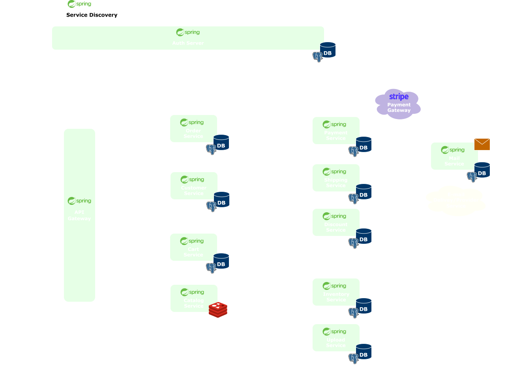
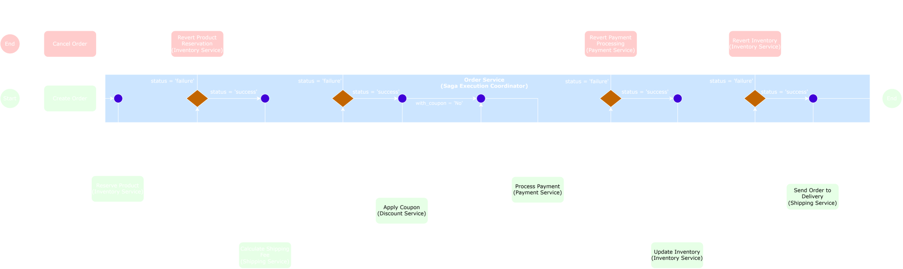
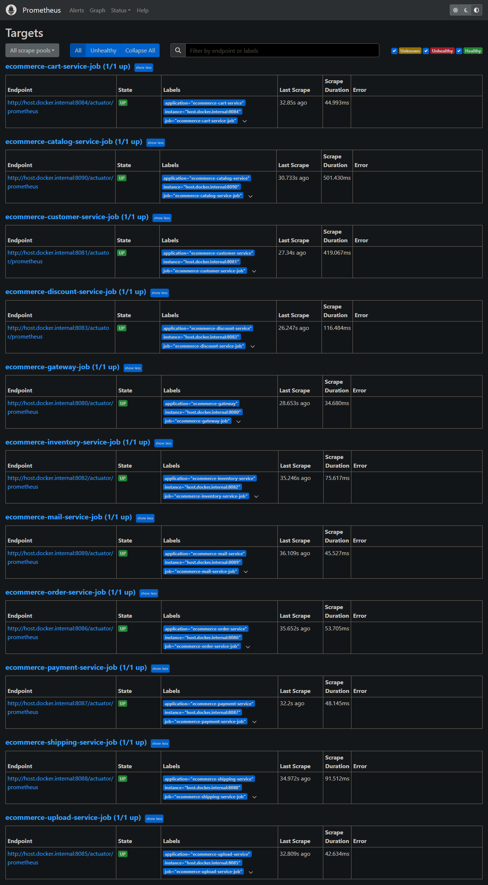
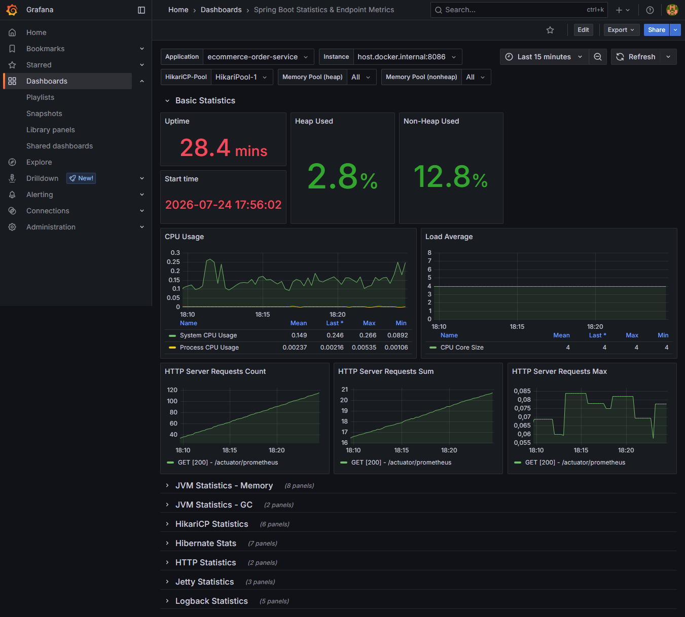

# E-commerce Microservices

E-commerce Microservices é uma plataforma distribuída de E-commerce desenvolvida com o objetivo de explorar a 
construção de sistemas distribuídos modernos utilizando o ecossistema do **Spring Framework**.

O sistema foi projetado seguindo uma arquitetura de microsserviços, onde cada componente possui responsabilidades de 
negócio bem definidas, banco de dados próprio e capacidade de evoluir de forma independente.

Durante o desenvolvimento, o foco não foi apenas implementar funcionalidades de negócio, mas também aplicar padrões 
arquiteturais amplamente utilizados em ambientes de produção, como **Event-Driven Architecture (EDA)**, **Saga 
Orchestration Pattern**, **API Gateway**, **Service Discovery**, **OAuth2/OpenID Connect**, além de estratégias de 
cache, comunicação assíncrona, tolerância a falhas e processamento distribuído.

Como resultado, o projeto demonstra como diferentes microsserviços podem colaborar para executar processos complexos - 
como o fluxo completo de compra de um pedido - mantendo baixo acoplamento, autonomia entre serviços e consistência 
de dados em um ambiente distribuído.
<br />

## 🏛️ Arquitetura 



O ecossistema é composto por **13 aplicações independentes** e uma **common library**, responsável por compartilhar 
componentes reutilizáveis entre as aplicações. 

Cada microsserviço representa um domínio específico do negócio, sendo responsável exclusivamente pelos seus próprios 
dados e regras de negócio, seguindo o princípio **Database Per Service**, que em conjunto, formam uma plataforma 
distribuída. Essa abordagem reduz o acoplamento entre os domínios, facilita a manutenção da aplicação e permite que 
cada serviço seja desenvolvido, implantado e escalado de forma independente.

A arquitetura está organizada em diferentes camadas de responsabilidade:

- **Service Discovery:** responsável pela descoberta automática das instâncias dos microsserviços.
- **Identity Provider:** autenticação e autorização centralizadas através de OAuth2/OpenID Connect.
- **API Gateway:** ponto único de entrada para todas as requisições externas.
- **Business Services:** implementação dos domínios de negócio da plataforma.
- **External Services:** integrações externas como Stripe, Redis e serviço de envio de e-mails.

O sistema utiliza uma abordagem híbrida para comunicação entre os microsserviços:

- **Comunicação síncrona (REST):** utilizado para consultas e operações que exigem resposta imediata.
- **Comunicação assíncrona:** utilizada para coordenação de processos distribuídos e publicação de eventos.

Essa combinação permite que cada tecnologia seja utilizada conforme sua finalidade, equilibrando simplicidade nas 
operações síncronas e baixo acoplamento nos fluxos distribuídos.

O principal fluxo distribuído da plataforma é o processamento de pedidos, implementado através de uma arquitetura 
orientada a eventos utilizando **Apache Kafka** e coordenado pelo **Saga Orchestration Pattern**, onde o 
**ecommerce-order-service** atua como orquestrador responsável por coordenar toda a transação distribuída entre os 
microsserviços participantes.

### Sumário
<ul>
  <li>
    <a href="#arch_principles">Princípios Arquiteturais e Padrões</a>
    <ul>
      <li><a href="#clean_arch">Clean Architecture</a></li>
      <li><a href="#microservices_arch">Microservices Architecture</a></li>
      <li><a href="#database_per_service">Database Per Service</a></li>
      <li><a href="#eda_arch">Event-Driven Architecture</a></li>
      <li><a href="#saga_pattern">Saga Orchestration Pattern</a></li>
      <li><a href="#gateway_pattern">API Gateway Pattern</a></li>
      <li><a href="#service_discovery_pattern">Service Discovery Pattern</a></li>
    </ul>
  </li>
  <li>
    <a href="#communication_model">Modelo de Comunicação</a>
    <ul>
      <li><a href="#sync_communication">Comunicação Síncrona (REST)</a></li>
      <li><a href="#async_communication">Comunicação Assíncrona (Apache Kafka)</a></li>
    </ul>
  </li>
  <li><a href="#auth">Autenticação e Autorização</a></li>
  <li><a href="#saga">Distributed Transactions (Saga Orchestration)</a></li>
  <li><a href="#payment_processing">Processamento de Pagamentos</a></li>
  <li><a href="#logistic_processing">Processamento Logístico</a></li>
  <li>
    <a href="#platform_components">Componentes da Plataforma</a>
    <ul>
      <li><a href="#tech">Tecnologias utilizadas</a></li>
      <li>
        <a href="#microservices">Microsserviços</a>
        <ul>
          <li><a href="#service_discovery">ecommerce-service-discovery</a></li>
          <li><a href="#auth_server">ecommerce-auth-server</a></li>
          <li><a href="#gateway">ecommerce-gateway</a></li>
          <li><a href="#cart_service">ecommerce-cart-service</a></li>
          <li><a href="#catalog_service">ecommerce-catalog-service</a></li>
          <li><a href="#customer_service">ecommerce-customer-service</a></li>
          <li><a href="#discount_service">ecommerce-discount-service</a></li>
          <li><a href="#inventory_service">ecommerce-inventory-service</a></li>
          <li><a href="#mail_service">ecommerce-mail-service</a></li>
          <li><a href="#order_service">ecommerce-order-service</a></li>
          <li><a href="#payment_service">ecommerce-payment-service</a></li>
          <li><a href="#shipping_service">ecommerce-shipping-service</a></li>
          <li><a href="#upload_service">ecommerce-upload-service</a></li>
        </ul>
      </li>
    </ul>
  </li>
  <li><a href="#running">Executando a Plataforma</a></li>
  <li><a href="#endpoints">Rotas da API</a></li>
  <li><a href="#conclusion">Considerações Finais</a></li>
  <li><a href="#license">Licença</a></li>
  <li><a href="#author">Autor</a></li>
</ul>

<hr />

<h2 id="arch_principles">🏗️ Princípios Arquiteturais e Padrões</h2>

A arquitetura da plataforma foi construída com o objetivo de reproduzir conceitos amplamente utilizados no 
desenvolvimento de sistemas distribuídos modernos. Durante o desenvolvimento, buscou-se priorizar baixo acoplamento 
entre componentes, alta coesão dos domínios de negócio, facilidade de manutenção e capacidade de evolução 
independente dos serviços.

Os principais princípios e padrões arquiteturais adotados são:

<h3 id="clean_arch">Clean Architecture</h3>

Sempre que aplicável, os microsserviços foram estruturados seguindo os princípios da **Clean Architecture**, 
separando a camada de negócio (*Core*) da camada de infraestrutura.

Essa separação reduz o acoplamento entre regras de negócio e tecnologias externas, tornando a aplicação mais 
testável, manutenível e adaptável a mudanças de infraestrutura.

<h3 id="microservices_arch">Microservices Architecture</h3>

A plataforma foi dividida em múltiplos microsserviços independentes, onde cada aplicação é responsável por um 
domínio específico do negócio.

Essa abordagem permite que cada serviço seja desenvolvido, implantado e escalado individualmente, além de reduzir 
dependências entre diferentes áreas da aplicação.

<h3 id="database_per_service">Database Per Service</h3>

Cada microsserviço possui seu próprio banco de dados, sendo o único responsável pelo gerenciamento das informações 
pertencentes ao seu domínio.

Essa estratégia promove isolamento de dados entre serviços, reduz o acoplamento da arquitetura e elimina 
dependências diretas entre bancos de dados compartilhados.

<h3 id="eda_arch">Event-Driven Architecture (EDA)</h3>

Processos distribuídos são coordenados através de uma arquitetura orientada a eventos utilizando o **Apache Kafka** 
como plataforma de mensageria.

Em vez de depender exclusivamente de chamadas síncronas entre serviços, eventos e comandos são publicados para 
coordenar fluxos assíncronos, reduzindo o acoplamento e aumentando a escalabilidade da plataforma.

<h3 id="saga_pattern">Saga Orchestration Pattern</h3>

O processo distribuído de pedidos é implementado através do **Saga Orchestration Pattern**, onde o 
**ecommerce-order-service** atua como orquestrador responsável por coordenar todas as etapas da transação.

Durante a execução do Saga, comandos são enviados aos microsserviços participantes através do **Kafka**, enquanto 
respostas assíncronas determinam a evolução da transação, permitindo confirmar ou compensar operações quando necessário.

<h3 id="gateway_pattern">API Gateway Pattern</h3>

Todas as requisições externas são centralizadas pelo **ecommerce-gateway**, responsável pelo roteamento das chamadas 
para os microsserviços internos, autenticação dos usuários e exposição unificada das APIs da plataforma.

Esse modelo desacopla clientes da localização física dos microsserviços e simplifica a comunicação com o backend.

<h3 id="service_discovery_pattern">Service Discovery Pattern</h3>

O **ecommerce-service-discovery**, baseado no **Spring Cloud Netflix Eureka**, é responsável por registrar 
automaticamente todas as instâncias dos microsserviços.

Dessa forma, os serviços podem localizar uns aos outros dinamicamente, eliminando dependências de endereços fixos e 
facilitando a escalabilidade da aplicação.

<h2 id="communication_model">🔄 Modelo de Comunicação</h2>

Embora a plataforma seja composta por microsserviços independentes, diversas operações exigem colaboração entre 
diferentes domínios de negócio. Para atender a diferentes necessidades de comunicação, a arquitetura utiliza uma 
abordagem híbrida, combinando chamadas síncronas via REST com mensageria assíncrona através do Apache Kafka.

Cada mecanismo é utilizado de acordo com sua finalidade, buscando equilibrar simplicidade, desempenho e baixo 
acoplamento.

<h3 id="sync_communication">Comunicação Síncrona (REST)</h3>

Chamadas REST são utilizadas em operações que exigem resposta imediata, normalmente envolvendo consultas de 
informações ou validações realizadas durante o processamento de uma requisição.

Exemplos:

- Consulta de informações de clientes.
- Consulta de produtos e estoque.
- Recuperação de dados para composição de respostas ao usuário.

A comunicação síncrona é implementada utilizando o **RestClient**, recurso nativo do **Spring Framework**, combinado 
com **CompletableFuture** para permitir chamadas assíncronas e não bloqueantes quando apropriado.

<h3 id="async_communication">Comunicação Assíncrona (Apache Kafka)</h3>

Fluxos distribuídos e operações desacopladas são coordenados através do **Apache Kafka**.

Nesse modelo, os microsserviços comunicam-se por meio da publicação e consumo de comandos, eventos e mensagens de 
resposta, eliminando dependências diretas entre os participantes do fluxo.

Essa estratégia é utilizada principalmente em processos que envolvem múltiplos serviços ou execução em segundo plano.

Exemplos:

- Processamento distribuído de pedidos.
- Implementação do Saga Orchestration Pattern.
- Envio de notificações por e-mail.
- Sincronização da expiração de promoções e cupons.
- Propagação de eventos entre microsserviços.

A utilização de mensageria assíncrona permite que cada serviço execute suas responsabilidades de forma independente, 
contribuindo para maior escalabilidade, resiliência e desacoplamento da arquitetura.

<h2 id="auth">🔐 Autenticação e Autorização</h2>

A autenticação e autorização da plataforma são centralizadas no **ecommerce-auth-server**, responsável por atuar 
como **Authorization Server** e **Identity Provider (IdP)** utilizando os protocolos **OAuth2** e **OpenID Connect 
(OIDC)**.

Essa abordagem permite que todos os microsserviços deleguem completamente a responsabilidade de autenticação para um 
único componente da arquitetura, mantendo as aplicações de negócio focadas exclusivamente em seus respectivos domínios.

O fluxo de autenticação é iniciado no **ecommerce-gateway**, responsável por receber todas as requisições externas e 
encaminhá-las para os microsserviços internos.

Após a autenticação do usuário, o Authorization Server emite um **Access Token JWT**, utilizado pelos Resource 
Servers para validar a identidade do usuário e controlar o acesso aos recursos protegidos.

### Principais Características

- **Authorization Server:** Centraliza autenticação, autorização, emissão e gerenciamento dos Access Tokens.
- **Identity Provider (IdP):** Responsável por armazenar identidades dos usuários e executar todo o processo de 
  autenticação.
- **OAuth2 Clients:** Cada aplicação que compõe o ecossistema do E-commerce é registrada como um OAuth2 Client, 
  possuindo seus próprios **scopes**, responsáveis por determinar quais Resource Servers podem ser acessados.
- **OAuth2 Resource Servers:** Os microsserviços responsáveis por proteger recursos validam os Access Tokens 
  emitidos pelo Authorization Server antes de processar qualquer requisição autenticada.
- **Role-Based Access Control (RBAC):** As permissões dos usuários são definidas através de **roles**, permitindo 
  restringir operações administrativas e recursos protegidos de acordo com o perfil do usuário.
- **JWT Authentication:** A autenticação entre clientes e microsserviços é realizada através de Access Tokens JWT 
  assinados pelo Authorization Server.
- **Persistência de Autorizações:** Clientes registrados, autorizações, consentimentos e tokens são persistidos em 
  banco de dados, permitindo gerenciamento centralizado das autenticações.

### Fluxo de Autenticação

A plataforma suporta dois mecanismos de autenticação, dependendo do tipo de cliente que está consumindo a aplicação.

- **Authorization Code Flow**

  Para clientes baseados em navegador, o **ecommerce-gateway** atua como cliente OAuth2, iniciando automaticamente o 
  fluxo de **Authorization Code** quando uma requisição é realizada para um recurso protegido.
  
  Caso o usuário ainda não esteja autenticado, ele é redirecionado para a página de login do 
  **ecommerce-auth-server**. Após a autenticação, o Authorization Server emite os tokens necessários e o usuário é 
  redirecionado para o recurso originalmente solicitado.
  

- **JWT Authentication**

  Para clientes que já possuem um Access Token (como aplicações frontend, clientes mobile ou ferramentas como Postman), 
  as requisições são enviadas contendo o token JWT no cabeçalho **Authorization: Bearer**.

  O **ecommerce-gateway** verifica apenas a existência do Bearer Token e encaminha a requisição diretamente para o 
  microsserviço responsável.

  A validação da autenticidade do JWT é realizada pelo próprio Resource Server, que consulta o 
  **ecommerce-auth-server** sempre que necessário para validar a assinatura e as informações do token.

  Essa abordagem mantém o Gateway desacoplado das responsabilidades de validação dos tokens, permitindo que cada 
  microsserviço seja responsável pela proteção dos seus próprios recursos.

<h2 id="saga">📦 Distributed Transactions (Saga Orchestration)</h2>

Uma das principais características desta plataforma é o processamento distribuído de pedidos.

Em uma arquitetura de microsserviços, cada serviço possui autonomia sobre seus próprios dados e regras de negócio. 
Como consequência, operações que envolvem múltiplos domínios - como a criação de um pedido - deixam de poder 
utilizar transações tradicionais de banco de dados.

No fluxo de compra desta plataforma, um único pedido depende da colaboração entre diversos microsserviços independentes:

- Validação do cliente.
- Reserva de produtos no estoque.
- Cálculo do frete.
- Aplicação de cupons de desconto.
- Processamento do pagamento.
- Confirmação da reserva do estoque.
- Geração da entrega.
- Envio de notificações.

Caso qualquer uma dessas etapas falhe, todo o processo deve ser interrompido, preservando a consistência dos dados 
entre os diferentes domínios da aplicação.

Para resolver esse problema, o projeto implementa o **Saga Orchestration Pattern**, coordenando todo o fluxo 
distribuído através de uma arquitetura orientada a eventos utilizando **Apache Kafka**.

### Arquitetura do Saga



O **ecommerce-order-service** atua como o **Saga Execution Coordinator**, sendo responsável por controlar todo o 
ciclo de vida da transação distribuída.

Diferentemente de uma abordagem baseada em **Saga Choreography**, onde cada microsserviço decide automaticamente 
quais eventos produzir e consumir, nesta implementação todas as decisões de negócio permanecem centralizadas no 
orquestrador.

Durante a execução do Saga, o Order Service:

- Inicia a transação distribuída.
- Publica comandos para os microsserviços participantes.
- Recebe respostas assíncronas através do Apache Kafka.
- Decide qual será a próxima etapa da transação.
- Registra o estado atual do Saga.
- Inicia operações de compensação quando necessário.
- Finaliza a transação após todos os participantes concluírem suas responsabilidades.

Essa abordagem concentra toda a lógica de coordenação em um único componente, mantendo os demais microsserviços 
responsáveis exclusivamente pelas operações pertencentes aos seus respectivos domínios de negócio.

### Visão Geral da Implementação

A implementação do Saga foi projetada para coordenar transações distribuídas preservando a autonomia dos 
microsserviços e garantindo consistência entre os diferentes domínios da aplicação.

As principais características da implementação são:

- Arquitetura orientada a eventos utilizando **Apache Kafka**.
- Saga Orchestration centralizada pelo **ecommerce-order-service**.
- State Machine para controle do fluxo de transação.
- Persistência do estado do Saga e dos participantes.
- Operações de compensação distribuídas.
- Reserva de produtos utilizando **Pessimistic Locking**.
- Coordenação assíncrona entre microsserviços.
- Ausência de transações distribuídas (2PC).
- Baixo acoplamento entre os participantes da transação.

### Arquitetura Orientada a Eventos

Toda a comunicação do Saga ocorre através do **Apache Kafka**.

Cada etapa da transação segue o mesmo fluxo de comunicação:

```text
                      Order Service
                           |
                           ▼
                   Publica um Command
                           |
                           ▼
                  Serviço Participante
                           |
               Executa sua operação local
                           |
                           ▼
                   Publica uma Reply
                           |
                           ▼
                      Order Service
                           |
               Decide a próxima transação
```

Nesse modelo, os microsserviços participantes nunca se comunicam diretamente entre si.

Cada participante recebe um comando, executa sua própria transação local e publica uma resposta indicando sucesso ou 
falha.

Essa estratégia reduz significativamente o acoplamento entre os serviços e permite que novos participantes sejam 
incorporados ao fluxo sem alterar a comunicação existente entre os demais componentes.

### State-Driven Saga

O fluxo da transação é controlado por uma **State Machine**, responsável por determinar qual ação deve ser executada 
em cada etapa do Saga.

Cada resposta recebida através do Kafka provoca uma transição de estado, permitindo que o orquestrador determine 
dinamicamente o próximo comando a ser publicado ou inicie operações de compensação quando necessário.

Essa abordagem torna o fluxo explícito, previsível e facilmente extensível para novos cenários de negócio.

### Persistência da Transação

Durante toda a execução do Saga, o estado da transação distribuída é persistido pelo **ecommerce-order-service**.

Além do estado atual da transação, também são armazenadas informações sobre cada participante envolvido no 
processamento do pedido, permitindo rastrear toda a evolução do Saga e possibilitando recuperação consistente em 
caso de falhas da aplicação.

### Operações de Compensação

Em vez de utilizar rollbacks distribuídos, cada microsserviço é responsável por executar sua própria operação de 
compensação.

Caso uma etapa falhe, o orquestrador identifica os participantes que concluíram suas operações com sucesso e publica 
comandos de compensação para desfazer apenas as alterações necessárias.

Essa estratégia preserva a autonomia dos microsserviços e elimina a necessidade de protocolos de transação 
distribuída como o **Two-Phase Commit (2PC)**.

### Reserva de Estoque

O processamento do estoque foi projetado para evitar inconsistências causadas por compras concorrentes.

Durante o início da transação, os produtos são apenas **reservados**, permanecendo indisponíveis para outras compras,
mas sem redução definitiva do estoque.

A quantidade disponível somente é atualizada após a confirmação bem-sucedida do pagamento.

Para garantir consistência durante essa operação, o Inventory Service utiliza **PESSIMISTIC_WRITE**, impedindo que 
múltiplas transações reservem simultaneamente o mesmo produto.

<h2 id="payment_processing">💳 Processamento de Pagamentos</h2>

O processamento de pagamentos da plataforma é centralizado no **ecommerce-payment-service**, responsável por 
executar todas as operações financeiras relacionadas aos pedidos.

A implementação foi projetada para simular um fluxo de pagamentos próximo ao encontrado em aplicações reais, 
integrando a plataforma ao gateway de pagamentos **Stripe** e participando diretamente do fluxo distribuído 
coordenado pelo Saga.

### Integração com Stripe

A comunicação com o gateway de pagamentos é realizada através do SDK oficial do Stripe.

Durante o processamento de um pedido, o microsserviço cria automaticamente uma **Checkout Session**, permitindo que 
o usuário conclua a compra utilizando a página de pagamento hospedada pelo próprio Stripe.

Atualmente são suportadas as seguintes formas de pagamento:

- Cartão de crédito.
- Boleto.

### Ambiente de Desenvolvimento

Para permitir testes completos da plataforma sem a necessidade de transações financeiras reais, o projeto implementa 
um ambiente de simulação utilizando os recursos oferecidos pelo Stripe.

Sempre que um cliente inicia seu primeiro processo de pagamento, uma conta é automaticamente criada na plataforma 
Stripe utilizando o e-mail cadastrado no **ecommerce-customer-service**.

Essa conta é inicializada com um saldo positivo de **R$ 10.000,00**, permitindo simular cenários reais de:

- Pagamentos aprovados.
- Saldo insuficiente.
- Cancelamento.
- Compensações do Saga.

Essa abordagem possibilita validar todo o fluxo distribuído de pagamento sem depender de operações monetárias reais.

### Aplicação de Promoções

Antes da criação da sessão de pagamento, o microsserviço verifica automaticamente a existência de promoções e cupons 
aplicados ao pedido.

Quando encontrados, os descontos são enviados para o Stripe utilizando os recursos nativos da plataforma, garantindo 
que o valor apresentado ao cliente corresponda exatamente ao valor calculado pelo domínio de negócio da aplicação.

### Participação no Saga

Durante o processamento distribuído de pedidos, o Payment Service atua como um participante do Saga.

Após receber um comando do **ecommerce-order-service**, o serviço executa a operação financeira e publica uma 
resposta através do **Apache Kafka** indicando sucesso ou falha na transação.

Caso o processamento distribuído seja cancelado posteriormente, o microsserviço executa sua operação de compensação 
realizando o estorno do valor debitado do cliente.

### Eventos de Domínio

Após alterações relevantes no ciclo de vida do pagamento, o microsserviço publica eventos através do **Apache 
Kafka** para outros componentes da plataforma.

Entre os principais eventos emitidos estão:

- Pagamento aprovado.
- Emissão da nota fiscal.

Esses eventos são consumidos pelo **ecommerce-mail-service**, responsável pelo envio automático das notificações aos 
clientes.

<h2 id="logistic_processing">🚚 Processamento Logístico</h2>

Após a conclusão bem-sucedida da transação distribuída coordenada pelo **ecommerce-order-service**, a plataforma 
inicia automaticamente o processo de entrega do pedido.

Essa etapa é responsabilidade do **ecommerce-shipping-service**, que passa a ser o proprietário do ciclo de vida 
logístico da compra, desde o cálculo do frete até a confirmação da entrega ao cliente.

### Cálculo de Frete

Durante o processamento do pedido, o valor do frete é calculado pelo **ecommerce-shipping-service**.

Para fins de desenvolvimento, a aplicação inicializa automaticamente uma tabela de preços baseada em duas variáveis:

- Distância da entrega.
- Peso do produto.

Na primeira inicialização da aplicação, essa tabela é inserida automaticamente no banco de dados através de um 
processo de **database seeding**, permitindo que diferentes cenários de entrega sejam simulados durante os testes da 
plataforma.

Para cada novo pedido, uma combinação de distância e peso é selecionada de forma randômica, simulando diferentes 
custos logísticos encontrados em aplicações reais.

### Integração com o Saga

O Shipping Service representa a última etapa do fluxo de processamento do pedido.

Após a aprovação do pagamento, o **ecommerce-order-service** solicita ao **ecommerce-inventory-service** que efetive 
a reserva dos produtos, reduzindo definitivamente a quantidade disponível em estoque.

Somente após a confirmação dessa operação o Order Service publica um comando para o **ecommerce-shipping-service**, 
iniciando oficialmente o processo de entrega.

Essa sequência garante que pedidos somente avancem para a etapa logística após todas as operações críticas da 
transação distribuída terem sido concluídas com sucesso.

### Ciclo de Vida da Entrega

Após receber o comando de confirmação, o Shipping Service registra o pedido com o status inicial:

- **PREPARING**

  Utilizando o mecanismo de **Task Scheduling** do Spring Framework, a evolução da entrega é automaticamente planejada.
  Cinco minutos após o início do processamento, o status é atualizado para:

- **OUT_FOR_DELIVERY**

  Automaticamente, uma nova tarefa é agendada para executar mais cinco minutos depois, alterando o status para:

- **DELIVERED**


Essa abordagem permite simular todo o ciclo logístico de um pedido sem intervenção manual, reproduzindo o 
comportamento esperado de plataformas de comércio eletrônico reais.

### Eventos de Domínio

Cada alteração de status da entrega gera um evento publicado através do **Apache Kafka**.

Esses eventos são consumidos pelo **ecommerce-mail-service**, responsável por enviar notificações automáticas ao 
cliente durante todas as etapas da entrega.

Entre os principais eventos publicados estão:

- Pedido em preparação.
- Pedido saiu para entrega.
- Pedido entregue.

Essa estratégia desacopla completamente o processo logístico do sistema de notificações, permitindo que novos 
consumidores sejam adicionados futuramente sem alterar o Shipping Service.

<h2 id="observability">📊 Observabilidade</h2>

Em uma arquitetura distribuída, compreender o comportamento da plataforma é tão importante quanto implementar suas 
funcionalidades.

Como as operações de negócio são executadas por diversos microsserviços independentes, utilizando comunicação 
síncrona (REST) e assíncrona (Apache Kafka), torna-se fundamental possuir mecanismos que permitam acompanhar a saúde 
da plataforma, identificar gargalos, monitorar consumo de recursos e diagnosticar falhas durante a execução.

Com esse objetivo, toda a plataforma foi projetada para ser observável, utilizando o ecossistema de observabilidade 
do Spring Boot em conjunto com **Prometheus** e **Grafana**.

### Spring Boot Actuator

Cada microsserviço expõe métricas operacionais através do **Spring Boot Actuator**, disponibilizando informações 
relacionadas ao estado da aplicação e sua execução.

Entre as principais métricas disponibilizadas estão:

- Utilização de memória.
- Utilização de CPU.
- Número de requisições HTTP.
- Tempo de resposta das APIs.
- Métricas da JVM.
- Métricas do pool de conexões.
- Métricas do servidor embarcado.

Essa abordagem fornece uma visão padronizada do comportamento de todos os microsserviços da plataforma.

### Coleta Centralizada de Métricas

Todas as métricas expostas pelos microsserviços são coletadas automaticamente pelo **Prometheus**.

Na raiz do projeto existe um módulo dedicado à observabilidade da plataforma, contendo toda a infraestrutura 
necessária para inicializar e configurar o ambiente de monitoramento através do Docker Compose.

Durante sua inicialização, o Prometheus é configurado para descobrir e coletar periodicamente as métricas 
disponibilizadas pelos endpoints do Spring Boot Actuator de cada microsserviço, centralizando todas as informações 
operacionais da plataforma.



### Dashboards

As métricas coletadas pelo Prometheus são visualizadas através do **Grafana**.

O ambiente de observabilidade disponibiliza dashboards previamente configurados, carregados automaticamente durante 
a inicialização da plataforma, permitindo acompanhar em tempo real o comportamento dos microsserviços.

Esses painéis fornecem uma visão consolidada da saúde da aplicação, facilitando a identificação de anomalias, 
análise de desempenho e acompanhamento da utilização dos recursos da infraestrutura.

Essa estratégia torna possível observar toda a plataforma distribuída a partir de um único ponto, simplificando 
atividades de monitoramento, troubleshooting e análise de performance.



<h2 id="platform_components">🧩 Componentes da Plataforma</h2>

Após compreender os principais conceitos arquiteturais utilizados pela plataforma, esta seção descreve cada 
microsserviço individualmente, destacando sua responsabilidade de negócio, seu papel dentro da arquitetura 
distribuída e as principais características técnicas implementadas.

Embora cada aplicação possua autonomia sobre seu domínio, todas colaboram para formar uma plataforma distribuída 
orientada a eventos, onde processos síncronos e assíncronos coexistem para atender diferentes necessidades de negócio.

<h3 id="tech">Tecnologias utilizadas</h3>

Ferramentas que foram utilizadas na construção da plataforma:
- [Java 21](https://docs.oracle.com/en/java/javase/21/)
- [Spring Boot](https://spring.io/projects/spring-boot)
- [Spring Boot Actuator](https://docs.spring.io/spring-boot/reference/actuator/enabling.html)
- [Spring Authorization Server](https://spring.io/projects/spring-authorization-server)
- [Spring Cloud Gateway](https://docs.spring.io/spring-cloud-gateway/docs/current/reference/html/)
- [Spring Cloud Netflix Eureka](https://docs.spring.io/spring-cloud-netflix/docs/current/reference/html/)
- [Spring Mail Sender](https://docs.spring.io/spring-framework/reference/integration/email.html)
- [JPA + Hibernate](https://spring.io/projects/spring-data-jpa#overview)
- [Java Bean Validation](https://docs.spring.io/spring-framework/reference/core/validation/beanvalidation.html#validation-beanvalidation-overview)
- [JUnit + Mockito](https://docs.spring.io/spring-framework/reference/testing.html)
- [Springdoc Openapi](https://springdoc.org)
- [Swagger](https://swagger.io)
- [Apache Kafka](https://kafka.apache.org)
- [Stripe Payment Gateway](https://stripe.com/br)
- [Redis](https://redis.io/solutions/caching/)
- [Resilience4j](https://resilience4j.readme.io/docs/getting-started-3)
- [Prometheus](https://prometheus.io)
- [Grafana](https://grafana.com)
- [Thymeleaf](https://www.thymeleaf.org)
- [PostgreSQL](https://www.postgresql.org)
- [Maven](https://maven.apache.org)
- [Mailpit](https://mailpit.axllent.org)
- [Docker](https://www.docker.com)

<h3 id="microservices">Microsserviços</h3>

As aplicações foram estruturadas utilizando **Clean Architecture** (onde se fez necessário), separando a camada core 
(domain, application) da camada de infraestrutura, como uma forma de manter o código manutenível, testável, 
adaptável e padronizado. Desta forma, qualquer mudança em qualquer microsserviço se torna um processo mais direto 
e uniforme.

- <h3 id="service_discovery">ecommerce-service-discovery</h3>
  O **ecommerce-service-discovery** atua como o registro central de serviços da plataforma.
  
  Seu papel é permitir que os microsserviços localizem dinamicamente uns aos outros sem depender de endereços fixos, 
  simplificando a comunicação entre os componentes e permitindo que novas instâncias sejam adicionadas ou removidas 
  da arquitetura sem alterações de configuração.
  <br /><br />
  Principais características:
  - Registro automático das instâncias dos microsserviços.
  - Descoberta dinâmica de serviços utilizando **Spring Cloud Netflix Eureka**.
  - Eliminação de dependências de endereços estáticos.
  - Suporte à escalabilidade horizontal da plataforma.

- <h3 id="auth_server">ecommerce-auth-server</h3>
  O **ecommerce-auth-server** centraliza toda a autenticação e autorização da plataforma, atuando simultaneamente 
  como **Authorization Server** e **Identity Provider (IdP)**.

  É responsável por autenticar os usuários, armazenar e gerenciar suas identidades, emitir e validar tokens de 
  acesso, permitindo que os dados dos servidores de recursos (services) sejam acessados de forma segura e controlada.
  
  Ao concentrar todas as responsabilidades relacionadas à identidade dos usuários em um único componente, os 
  microsserviços de negócio permanecem responsáveis exclusivamente pelas regras de seus respectivos domínios.
  <br /><br />
  Principais características:
  - Implementação dos protocolos **OAuth2** e **OpenID Connect**.
  - Emissão e gerenciamento de Access Tokens JWT.
  - Gerenciamento de **OAuth2 Clients**.
  - Controle de permissões através de **scopes** e **roles**.
  - Persistência de autorizações, consentimentos e tokens.

- <h3 id="gateway">ecommerce-gateway</h3>
  O **ecommerce-gateway** representa o ponto único de entrada da plataforma.

  Além de centralizar o acesso aos microsserviços internos, também é responsável por iniciar o fluxo **Authorization 
  Code** para clientes baseados em navegador e encaminhar requisições autenticadas através de Access Token JWT.
  <br /><br />
  Principais características:
  - API Gateway centralizado.
  - Roteamento de requisições.
  - Implementação do **Authorization Code Flow**.
  - Encaminhamento de requisições autenticadas por JWT.
  - Exposição unificada da documentação OpenAPI dos microsserviços.

- <h3 id="cart_service">ecommerce-cart-service</h3>
  O **ecommerce-cart-service** é responsável por gerenciar os carrinhos de compra dos usuários.

  Sua responsabilidade é manter salvo os produtos selecionados pelo cliente antes da criação definitiva do 
  pedido, permitindo alterações independentes do fluxo de compra.
  <br /><br />
  Principais características:
  - Gerenciamento de carrinhos.
  - Controle de itens do carrinho.
  - Integração com **ecommerce-inventory-service** para consulta de produtos.

- <h3 id="catalog_service">ecommerce-catalog-service</h3>
  O **ecommerce-catalog-service** atua como uma camada de agregação responsável por construir a página inicial do 
  E-commerce.

  Em vez de consultar o serviço de inventário a cada requisição, o catálogo é previamente montado, armazenado em 
  cache e atualizado periodicamente, reduzindo significativamente a latência e a quantidade de chamadas aos serviços 
  de origem.
  <br /><br />
  Principais características:
  - Agregação de produtos por categoria.
  - Cache distribuído utilizando **Redis**.
  - Renovação automática do catálogo através de **Task Scheduling**.
  - Processamento assíncrono utilizando **CompletableFuture** e **Thread Pools**.

- <h3 id="customer_service">ecommerce-customer-service</h3>
  O **ecommerce-customer-service** é responsável pelo gerenciamento das contas dos usuários do E-commerce, 
  armazenando informações cadastrais, endereços, dados de contato e demais informações necessárias durante o 
  processo de compra.

  Além de armazenar os dados dos clientes, atua como fonte oficial dessas informações para os demais microsserviços 
  durante o processamento de pedidos e demais operações de negócio.
  <br /><br />
  Principais características:
  - Gerenciamento de perfis de clientes.
  - Consulta de informações durante o processamento de pedidos.
  - Resource Server protegido por **OAuth2**.

- <h3 id="discount_service">ecommerce-discount-service</h3>
  O **ecommerce-discount-service** concentra todas as regras relacionadas a promoções e cupons de desconto da 
  plataforma.

  Além da validação durante o processamento de pedidos, também coordena automaticamente o ciclo de vida das 
  promoções através de tarefas agendadas e eventos publicados no **Apache Kafka**.
  <br /><br />
  Principais características:
  - Gerenciamento de promoções e cupons.
  - Expiração automática utilizando **Task Scheduling**.
  - Publicação de eventos de invalidação através do **Apache Kafka**.

- <h3 id="inventory_service">ecommerce-inventory-service</h3>
  O **ecommerce-inventory-service** representa a fonte oficial das informações de produtos e estoque da plataforma.
  
  Além do gerenciamento administrativo do estoque, desempenha um papel fundamental durante o processamento 
  distribuído de pedidos, garantindo consistência das reservas de produtos através de mecanismos de controle de 
  concorrência.
  <br /><br /> 
  Principais recursos:
  - Gerenciamento de produtos.
  - Controle de estoque.
  - Reserva de produtos para processamento de pedidos.
  - Pessimistic Locking utilizando **PESSIMISTIC_WRITE**.

- <h3 id="mail_service">ecommerce-mail-service</h3>
  O **ecommerce-mail-service** centraliza toda a comunicação por e-mail da plataforma.
  
  Seu objetivo é desacoplar completamente o envio de notificações das regras de negócio dos demais microsserviços, 
  permitindo que comunicações sejam executadas de forma assíncrona.
  <br /><br />
  Principais características:
  - Envio de e-mails.
  - Templates dinâmicos utilizando o **Thymeleaf**.
  - Processamento assíncrono através do **Apache Kafka**.

- <h3 id="order_service">ecommerce-order-service</h3>
  O **ecommerce-order-service** representa o núcleo do processamento distribuído da plataforma.

  Além do gerenciamento dos pedidos, atua como **Saga Execution Coordinator**, sendo responsável por coordenar todas 
  as etapas da transação distribuída através de uma arquitetura orientada a eventos utilizando **Apache Kafka**.

  Toda a lógica de coordenação permanece centralizada neste microsserviço, enquanto os demais participantes 
  permanecem responsáveis apenas pelas operações pertencentes aos seus respectivos domínios.
  <br /><br />
  Principais características:
  - Gerenciamento de pedidos.
  - Saga Orchestration.
  - Coordenação de transações distribuídas.
  - State Machine para controle do Saga.
  - Persistência do estado da transação.
  - Operações de compensação.

- <h3 id="payment_service">ecommerce-payment-service</h3>
  O **ecommerce-payment-service** representa o domínio financeiro da plataforma, sendo responsável por executar, 
  confirmar, cancelar e compensar todas as operações relacionadas ao pagamento dos pedidos.
  
  Além de integrar a plataforma ao gateway de pagamentos **Stripe**, este microsserviço participa diretamente do 
  fluxo de transações distribuídas coordenado pelo **ecommerce-order-service**, atuando como um dos participantes do 
  Saga durante o processamento de um pedido.
  <br /><br />
  Principais características:
  - Processamento de pagamentos através da plataforma **Stripe**.
  - Suporte a pagamentos via **cartão de crédito** e **boleto**.
  - Integração com **Stripe Checkout**.
  - Aplicação automática de promoções e cupons.
  - Participação no Saga Orchestration Pattern.
  - Operações de compensação para estorno de pagamentos.
  - Publicação de eventos para outros microsserviços.

- <h3 id="shipping_service">ecommerce-shipping-service</h3>

  O **ecommerce-shipping-service** é responsável por gerenciar o processo de entrega dos pedidos da plataforma, 
  atuando desde o cálculo do frete até o acompanhamento do ciclo de vida da entrega.

  Após a confirmação do pagamento e a conclusão da transação distribuída coordenada pelo **ecommerce-order-service**,
  este microsserviço assume a responsabilidade pelo processamento logístico do pedido, simulando todas as etapas da 
  entrega até sua conclusão.
  <br /><br />
  Principais características:
  - Cálculo do valor do frete.
  - Gerenciamento do ciclo de vida da entrega.
  - Processamento assíncrono das mudanças de status.
  - Agendamento automático das etapas da entrega.
  - Publicação de eventos para o **ecommerce-mail-service**.

- <h3 id="upload_service">ecommerce-upload-service</h3>

  O **ecommerce-upload-service** é responsável pelo gerenciamento e armazenamento das imagens dos produtos da 
  plataforma.
  
  Além de centralizar toda a manipulação de arquivos, este microsserviço separa o armazenamento físico das imagens 
  de seus metadados, permitindo que as informações dos arquivos sejam consultadas e gerenciadas independentemente 
  do sistema de arquivos utilizado.
  <br /><br />
  Principais características:
  - Armazenamento de imagens dos produtos.
  - Gerenciamento de metadados das imagens.
  - Criação automática do diretório de armazenamento utilizando a Java NIO API.
  - Classificação automática de imagens entre **THUMBNAIL** e **SHOWCASE**.
  - Resource Server protegido por OAuth2.
  
  #### Organização das Imagens
  
  Cada imagem armazenada possui uma finalidade definida dentro da plataforma.
  
  Durante o cadastro de um produto, a primeira imagem enviada é automaticamente classificada como **THUMBNAIL**, 
  sendo utilizada como imagem principal nas listagens e cards do catálogo.

  As demais imagens são classificadas como **SHOWCASE**, sendo utilizadas para uma exibição detalhada do produto em 
  sua página individual.

  Essa abordagem simplifica a recuperação das imagens pelos serviços consumidores e elimina a necessidade de regras 
  adicionais para identificar a imagem principal de cada produto.

Os microsserviços apresentados nesta seção representam os principais componentes que compõem a plataforma.

Embora cada aplicação possua responsabilidades bem definidas e independentes, todas colaboram através dos mecanismos 
de comunicação apresentados nas seções anteriores, formando uma arquitetura distribuída baseada em serviços 
especializados, comunicação orientada a eventos e coordenação de transações distribuídas.

<h2 id="running">🚀 Executando a Plataforma</h2>

A forma mais simples de executar a plataforma, é rodando localmente utilizando Docker/Docker Compose para 
provisionamento da infraestrutura e inicialização dos serviços de apoio.

### Pré-requisitos

Antes de iniciar a plataforma, é necessário ter instalado:

- Java 21
- Docker
- Docker Compose
- Git

### Stripe

Para executar o **ecommerce-payment-service** é necessário ter uma conta na plataforma Stripe para ter acesso a
[área de testes](https://docs.stripe.com/testing/overview) e às [chaves de API](https://docs.stripe.com/keys#obtain-api-keys),
que são necessárias para autenticar a integração entre o Stripe e o ecommerce-payment-service.

Uma vez criada a conta, é necessário instalar o [Stripe CLI](https://docs.stripe.com/cli) ([instalação em diferentes plataformas](https://github.com/stripe/stripe-cli#installation)),
que é responsável por redirecionar os eventos do processamento de pagamentos emitidos pelo Stripe, para o 
**ecommerce-payment-service** através de webhooks.

Com o **ecommerce-payment-service** e com o Stripe CLI instalado e configurado, usamos este comando no Stripe CLI:

```bash
$ stripe listen --forward-to http://localhost:8087/webhooks/stripe
```

Este é o comando para redirecionar os eventos do Stripe para o ecommerce-payment-service.

### Variáveis de Ambiente

Alguns serviços utilizam variáveis de ambiente contendo informações sensíveis (como chaves privadas de API e de 
criptografia, por exemplo). Para configurá-las:

- **ecommerce-auth-server**

  O ecommerce-auth-server utiliza um par de **RSA Keys** para assinatura dos tokens JWT emitidos.
  <br /><br />
  No diretório `resources` da aplicação, é necessário criar um arquivo `public.pem` que deverá conter a chave RSA 
  pública, e um arquivo `private.pem` que deverá conter a chave RSA privada.
  <br /><br />
  Também é possível definir um usuário com privilégios de Administrador no sistema através de variáveis de ambiente. 
  Basta definir as variáveis de ambiente `ADMIN_LOGIN` e `ADMIN_PASSWORD`, que serão usadas para criar e autenticar o 
  usuário administrador ao sistema.


- **ecommerce-payment-service**
  
  Para configurar a integração do ecommerce-payment-service com a plataforma Stripe, é necessário definir variáveis 
  de ambiente com chaves privadas. No diretório `resources` da aplicação, é necessário criar um arquivo `.env`.
  <br /><br />
  Este arquivo deve conter as chaves:

  ```bash
  STRIPE_SECRET_KEY=put the secret key here
  STRIPE_WEBHOOK_KEY=put the secret key here
  ```
  
  Ambas as chaves são fornecidas pelo Stripe ([Chaves de API do Stripe](https://docs.stripe.com/keys#obtain-api-keys)).

### Infraestrutura

Inicialize os containers responsáveis pela infraestrutura da plataforma:

- PostgreSQL
- Apache Kafka
- Mailpit
- Redis
- Prometheus
- Grafana

> **Observação:** O arquivo `docker-compose.yml` na raiz do projeto inicializa os containers do `PostgreSQL`, 
  `Apache Kafka`, `Mailpit` e `Redis`. Para inicializar os containers do `Prometheus` e `Grafana` acesse o diretório 
  `./config/observability`, e então execute o arquivo `docker-compose.yml`.

Para inicializar os containers execute o comando:

- Infrastructure

  ```bash
  $ docker compose up -d
  ```

- Observability

  ```bash
  $ cd ./config/observability
  $ docker compose up -d
  ```

### Ordem de Inicialização

Embora os microsserviços sejam independentes, alguns componentes possuem dependências durante sua inicialização. 
Recomenda-se inicializar a plataforma na seguinte ordem:

| Ordem | Microsserviço                      | Dependência Arquitetural                                                                                             |
|:-----:|------------------------------------|----------------------------------------------------------------------------------------------------------------------|
|   1   | **ecommerce-service-discovery**    | Permite que todos os microsserviços registrem suas instâncias e descubram os demais componentes da plataforma.       |
|   2   | **ecommerce-auth-server**          | Disponibiliza os metadados OAuth2 consumidos automaticamente pelos microsserviços configurados como OAuth2 Clients.  |
|   3   | **ecommerce-inventory-service**    | Atua como fonte de dados para o **ecommerce-catalog-service** durante sua inicialização.                             |
|   4   | **Todos os demais microsserviços** | Não possuem dependências obrigatórias de inicialização entre si, portanto, podem ser iniciados em qualquer ordem.    |

Após a inicialização de todos os microsserviços, a plataforma estará pronta para a utilização.

### Serviços Disponíveis

Após a inicialização da plataforma, os componentes poderão ser acessados através dos seguintes endereços:

| Serviço                     | URL                                           |
|-----------------------------|-----------------------------------------------|
| Eureka Dashboard            | `http://localhost:8761`                       |
| Swagger UI - Documentação   | `http://localhost:8080/swagger-ui/index.html` |
| Mailpit - Cliente de E-mail | `http://localhost:8025`                       |
| Prometheus                  | `http://localhost:9090`                       |
| Grafana                     | `http://localhost:3000`                       |

### Token de Acesso

É recomendado o uso de ferramentas de teste de APIs (como o [Postman](https://www.postman.com)) para obter os tokens 
de acesso. As configurações do protocolo OAuth2 para obter os tokens de acesso são:

| Propriedade      | Valor                                                       |
|------------------|-------------------------------------------------------------|
| Grant Type       | `authorization_code`                                        |
| Callback URL     | `http://127.0.0.1:8080/login/oauth2/code/ecommerce-gateway` |
| Auth URL         | `http://localhost:8180/oauth2/authorize`                    |
| Access Token URL | `http://localhost:8180/oauth2/token`                        |
| Client ID        | `ecommerce-gateway`                                         |
| Client Secret    | `gateway-client-secret`                                     |
| Scope            | `openid`,`profile`                                          |

<h2 id="endpoints">🧭 Rotas da API</h2>

As rotas `públicas` - criadas para serem integradas ao frontend e que não requerem privilégios administrativos - estão 
disponíveis através do Gateway `http://localhost:8080`. Já as rotas `privadas` - criadas para serem integradas à 
Dashboards administrativas e que requerem privilégios administrativos - estão disponíveis no host e porta do 
microsserviço correspondente.

### Customer

|  Tipo   | Rota                                                     | Descrição                               | Autenticação | Autorização |
|:-------:|----------------------------------------------------------|-----------------------------------------|:------------:|-------------|
| `POST`  | `http://localhost:8080/api/v1/customers/signup`          | Criar conta do cliente                  |     Não      | Todos       |
|  `GET`  | `http://localhost:8080/api/v1/customers/profile`         | Consultar perfil do cliente autenticado |     Sim      | `ROLE_USER` |
| `PATCH` | `http://localhost:8080/api/v1/customers/profile`         | Atualizar perfil do cliente autenticado |     Sim      | `ROLE_USER` |
| `POST`  | `http://localhost:8080/api/v1/customers/profile/address` | Inserir endereço do cliente             |     Sim      | `ROLE_USER` |
| `PATCH` | `http://localhost:8080/api/v1/customers/profile/address` | Atualizar endereço do cliente           |     Sim      | `ROLE_USER` |

### Inventory

- Product

  |   Tipo   | Rota                                                                                                                                      | Descrição                                                                | Autenticação | Autorização                 |
  |:--------:|-------------------------------------------------------------------------------------------------------------------------------------------|--------------------------------------------------------------------------|:------------:|-----------------------------|
  |  `POST`  | `http://localhost:8082/api/v1/products`                                                                                                   | Criar um produto                                                         |     Sim      | `ROLE_ADMIN`, `SCOPE_admin` |
  |  `GET`   | `http://localhost:8082/api/v1/products?category={categoryName}&brand={brandName}&model={modelName}&page={pageNumber}&pageSize={pageSize}` | Consultar produtos com filtros opcionais de categoria, marca e/ou modelo |     Sim      | `ROLE_ADMIN`, `SCOPE_admin` |
  |  `GET`   | `http://localhost:8080/api/v1/products/search?query={queryTerm}&page={pageNumber}&pageSize={pageSize}`                                    | Pesquisar produtos                                                       |     Não      | Todos                       |
  |  `GET`   | `http://localhost:8082/api/v1/products/all?page={pageNumber}&pageSize={pageSize}`                                                         | Consultar todos os produtos                                              |     Sim      | `ROLE_ADMIN`, `SCOPE_admin` |
  |  `GET`   | `http://localhost:8082/api/v1/products/{productId}`                                                                                       | Consultar um produto pelo Id                                             |     Sim      | `ROLE_ADMIN`, `SCOPE_admin` |
  | `PATCH`  | `http://localhost:8082/api/v1/products/{productId}`                                                                                       | Atualizar informações de um produto                                      |     Sim      | `ROLE_ADMIN`, `SCOPE_admin` |
  | `DELETE` | `http://localhost:8082/api/v1/products/{productId}`                                                                                       | Deletar um produto                                                       |     Sim      | `ROLE_ADMIN`, `SCOPE_admin` |
  |  `GET`   | `http://localhost:8082/api/v1/products/{productId}/stock`                                                                                 | Checar se um produto está em estoque                                     |     Sim      | `ROLE_ADMIN`, `SCOPE_admin` |
  | `PATCH`  | `http://localhost:8082/api/v1/products/{productId}/stock/add`                                                                             | Incrementar a quantidade de um produto no estoque                        |     Sim      | `ROLE_ADMIN`, `SCOPE_admin` |
  | `PATCH`  | `http://localhost:8082/api/v1/products/{productId}/stock/remove`                                                                          | Decrementar a quantidade de um produto no estoque                        |     Sim      | `ROLE_ADMIN`, `SCOPE_admin` |
  |  `GET`   | `http://localhost:8082/api/v1/products/category/{categoryName}?page={pageNumber}&pageSize={pageSize}`                                     | Consultar produtos por categoria                                         |     Sim      | `ROLE_ADMIN`, `SCOPE_admin` |
  |  `GET`   | `http://localhost:8082/api/v1/products/brand/{brandName}?page={pageNumber}&pageSize={pageSize}`                                           | Consultar produtos por marca                                             |     Sim      | `ROLE_ADMIN`, `SCOPE_admin` |
  |  `GET`   | `http://localhost:8082/api/v1/products/model/{modelName}/{brandName}?page={pageNumber}&pageSize={pageSize}`                               | Consultar produtos por modelo                                            |     Sim      | `ROLE_ADMIN`, `SCOPE_admin` |

- Model
  
  |   Tipo   | Rota                                                    | Descrição                               |  Autenticação  | Autorização                 |
  |:--------:|---------------------------------------------------------|-----------------------------------------|:--------------:|-----------------------------|
  |  `POST`  | `http://localhost:8082/api/v1/models`                   | Criar um modelo                         |      Sim       | `ROLE_ADMIN`, `SCOPE_admin` |
  |  `GET`   | `http://localhost:8082/api/v1/models?brandId={brandId}` | Consultar todos os modelos de uma marca |      Sim       | `ROLE_ADMIN`, `SCOPE_admin` |
  |  `GET`   | `http://localhost:8082/api/v1/models/{modelId}`         | Consultar modelo por Id                 |      Sim       | `ROLE_ADMIN`, `SCOPE_admin` | 
  | `PATCH`  | `http://localhost:8082/api/v1/models/{modelId}`         | Atualizar informações de um modelo      |      Sim       | `ROLE_ADMIN`, `SCOPE_admin` |
  | `DELETE` | `http://localhost:8082/api/v1/models/{modelId}`         | Deletar um modelo                       |      Sim       | `ROLE_ADMIN`, `SCOPE_admin` |

- Category
  
  |   Tipo   | Rota                                                    | Descrição                              | Autenticação | Autorização                 |
  |:--------:|---------------------------------------------------------|----------------------------------------|:------------:|-----------------------------|
  |  `POST`  | `http://localhost:8082/api/v1/categories`               | Criar uma categoria                    |     Sim      | `ROLE_ADMIN`, `SCOPE_admin` |
  |  `GET`   | `http://localhost:8082/api/v1/categories`               | Consultar todas as categorias          |     Sim      | `ROLE_ADMIN`, `SCOPE_admin` |
  |  `GET`   | `http://localhost:8082/api/v1/categories/{categoryId}`  | Consultar categoria por Id             |     Sim      | `ROLE_ADMIN`, `SCOPE_admin` |
  | `PATCH`  | `http://localhost:8082/api/v1/categories/{categoryId}`  | Atualizar informações de uma categoria |     Sim      | `ROLE_ADMIN`, `SCOPE_admin` |
  | `DELETE` | `http://localhost:8082/api/v1/categories/{categoryId}`  | Deletar uma categoria                  |     Sim      | `ROLE_ADMIN`, `SCOPE_admin` |
  |  `POST`  | `http://localhost:8082/api/v1/categories/subcategories` | Criar uma subcategoria                 |     Sim      | `ROLE_ADMIN`, `SCOPE_admin` |
  |  `GET`   | `http://localhost:8082/api/v1/categories/subcategories` | Consultar todas as subcategorias       |     Sim      | `ROLE_ADMIN`, `SCOPE_admin` |

- Brand
  
  |   Tipo   | Rota                                             | Descrição                          | Autorização | Autenticação                |
  |:--------:|--------------------------------------------------|------------------------------------|:-----------:|-----------------------------|
  |  `POST`  | `http://localhost:80822/api/v1/brands`           | Criar uma marca                    |     Sim     | `ROLE_ADMIN`, `SCOPE_admin` |
  |  `GET`   | `http://localhost:80822/api/v1/brands`           | Consultar todas as marcas          |     Sim     | `ROLE_ADMIN`, `SCOPE_admin` |
  |  `GET`   | `http://localhost:80822/api/v1/brands/{brandId}` | Consultar marca por Id             |     Sim     | `ROLE_ADMIN`, `SCOPE_admin` |
  | `PATCH`  | `http://localhost:80822/api/v1/brands/{brandId}` | Atualizar informações de uma marca |     Sim     | `ROLE_ADMIN`, `SCOPE_admin` |
  | `DELETE` | `http://localhost:80822/api/v1/brands/{brandId}` | Deletar uma marca                  |     Sim     | `ROLE_ADMIN`, `SCOPE_admin` |

### Cart
  
  |   Tipo   | Rota                                                | Descrição                            | Autenticação | Autorização   |
  |:--------:|-----------------------------------------------------|--------------------------------------|:------------:|---------------|
  |  `POST`  | `http://localhost:8084/api/v1/carts`                | Criar carrinho                       |     Sim      | `SCOPE_admin` |
  |  `POST`  | `http://localhost:8080/api/v1/carts/items`          | Adicionar item ao carrinho           |     Sim      | `ROLE_USER`   |
  |  `GET`   | `http://localhost:8080/api/v1/carts/items`          | Consultar todos os itens do carrinho |     Sim      | `ROLE_USER`   |
  | `DELETE` | `http://localhost:8080/api/v1/carts/items/{itemId}` | Remover item do carrinho             |     Sim      | `ROLE_USER`   |
  |  `GET`   | `http://localhost:8080/api/v1/carts/items/{itemId}` | Consultar item do carrinho por Id    |     Sim      | `ROLE_USER`   |
  | `PATCH`  | `http://localhost:8080/api/v1/carts/items/{itemId}` | Atualizar item do carrinho           |     Sim      | `ROLE_USER`   |

### Catalog
  
  | Tipo  | Rota                                   | Descrição                        | Autenticação | Autorização |
  |:-----:|----------------------------------------|----------------------------------|:------------:|-------------|
  | `GET` | `http://localhost:8080/api/v1/catalog` | Consultar o catálogo de produtos |     Não      | Todos       |

### Discount

- Promotion
  
  |   Tipo   | Rota                                                                                         | Descrição                                                 | Autenticação | Autorização                 |
  |:--------:|----------------------------------------------------------------------------------------------|-----------------------------------------------------------|:------------:|-----------------------------|
  |  `POST`  | `http://localhost:8083/api/v1/promotions`                                                    | Criar/aplicar promoção                                    |     Sim      | `ROLE_ADMIN`, `SCOPE_admin` |
  |  `GET`   | `http://localhost:8083/api/v1/promotions`                                                    | Consultar todas as promoções                              |     Sim      | `ROLE_ADMIN`, `SCOPE_admin` |
  |  `GET`   | `http://localhost:8083/api/v1/promotions/{promotionId}`                                      | Consultar promoção por Id                                 |     Sim      | `ROLE_ADMIN`, `SCOPE_admin` |
  | `PATCH`  | `http://localhost:8083/api/v1/promotions/{promotionId}`                                      | Atualizar informações da promoção                         |     Sim      | `ROLE_ADMIN`, `SCOPE_admin` |
  | `DELETE` | `http://localhost:8083/api/v1/promotions/{promotionId}`                                      | Deletar promoção                                          |     Sim      | `ROLE_ADMIN`, `SCOPE_admin` |
  |  `GET`   | `http://localhost:8083/api/v1/promotions/status?isActive={true\|\|false}`                    | Consultar todas as promoções ativas ou inativas           |     Sim      | `ROLE_ADMIN`, `SCOPE_admin` |
  |  `GET`   | `http://localhost:8083/api/v1/promotions/discount?discountType={fixed_amount\|\|percentage}` | Consultar todas promoções filtrando pelo tipo de desconto |     Sim      | `ROLE_ADMIN`, `SCOPE_admin` |

- Coupon
  
  |   Tipo   | Rota                                                                 | Descrição                        | Autenticação | Autorização                 |
  |:--------:|----------------------------------------------------------------------|----------------------------------|:------------:|-----------------------------|
  |  `POST`  | `http://localhost:8083/api/v1/coupons`                               | Criar cupom                      |     Sim      | `ROLE_ADMIN`, `SCOPE_admin` |
  |  `GET`   | `http://localhost:8083/api/v1/coupons`                               | Consultar todos os cupons        |     Sim      | `ROLE_ADMIN`, `SCOPE_admin` |
  |  `GET`   | `http://localhost:8083/api/v1/coupons/{couponId}`                    | Consultar cupom por Id           |     Sim      | `ROLE_ADMIN`, `SCOPE_admin` |
  | `DELETE` | `http://localhost:8083/api/v1/coupons/{couponId}`                    | Deletar cupom                    |     Sim      | `ROLE_ADMIN`, `SCOPE_admin` |
  |  `GET`   | `http://localhost:8083/api/v1/coupons/check?couponCode={couponCode}` | Checar se o cupom é válido       |     Sim      | `ROLE_ADMIN`, `SCOPE_admin` |
  |  `GET`   | `http://localhost:8083/api/v1/coupons/active`                        | Consultar todos os cupons ativos |     Sim      | `ROLE_ADMIN`, `SCOPE_admin` |

### Order
  
  |  Tipo  | Rota                                                                               | Descrição                                         | Autenticação | Autorização |
  |:------:|------------------------------------------------------------------------------------|---------------------------------------------------|:------------:|-------------|
  | `POST` | `http://localhost:8080/api/v1/orders`                                              | Criar pedido                                      |     Sim      | `ROLE_USER` |
  | `GET`  | `http://localhost:8080/api/v1/orders`                                              | Consultar todos os pedidos do usuário autenticado |     Sim      | `ROLE_USER` |
  | `GET`  | `http://localhost:8080/api/v1/orders/{orderId}`                                    | Consultar pedido por Id                           |     Sim      | `ROLE_USER` |
  | `GET`  | `http://localhost:8080/api/v1/orders/{orderId}/status?withDetails={true\|\|false}` | Consultar status do pedido                        |     Sim      | `ROLE_USER` |

### Upload
  
  |   Tipo   | Rota                                                    | Descrição                            | Autenticação | Autorização                 |
  |:--------:|---------------------------------------------------------|--------------------------------------|:------------:|-----------------------------|
  |  `POST`  | `http://localhost:8085/api/internal/uploads`            | Salvar todas as imagens do produto   |     Sim      | `ROLE_ADMIN`, `SCOPE_admin` |
  |  `GET`   | `http://localhost:8085/api/internal/uploads`            | Consultar as imagens dos produtos    |     Sim      | `ROLE_ADMIN`, `SCOPE_admin` |
  | `DELETE` | `http://localhost:8085/api/internal/uploads`            | Deletar as imagens dos produtos      |     Sim      | `ROLE_ADMIN`, `SCOPE_admin` |
  |  `GET`   | `http://localhost:8085/api/internal/uploads/thumbnails` | Consultar as thumbnails dos produtos |     Sim      | `ROLE_ADMIN`, `SCOPE_admin` |

<h2 id="conclusion">🎯 Considerações Finais</h2>

Este projeto foi desenvolvido com o objetivo de estudar e aplicar, de forma prática, conceitos fundamentais de 
arquitetura de software distribuída através da implementação de uma plataforma completa de E-commerce baseada em 
microsserviços.

Mais do que reproduzir funcionalidades de uma loja virtual, a proposta foi projetar um ecossistema onde cada 
microsserviço possua responsabilidades bem definidas, comunicação desacoplada e autonomia para evoluir de forma 
independente. Ao longo da implementação, foram priorizados aspectos arquiteturais como autenticação centralizada 
utilizando OAuth2, comunicação síncrona e orientada a eventos, transações distribuídas através do Saga Orchestration 
Pattern, observabilidade, cache distribuído, processamento assíncrono e integração com serviços externos.

Embora alguns componentes simulem comportamentos encontrados em ambientes reais - como o processamento de pagamentos,
o cálculo de frete e o fluxo logístico - todas as adaptações foram implementadas com o objetivo de reproduzir 
desafios comuns de sistemas distribuídos modernos, permitindo explorar padrões arquiteturais, mecanismos de 
consistência, escalabilidade e integração entre serviços.

Mais do que um conjunto de microsserviços desenvolvidos com Spring Boot, este projeto representa o estudo da 
construção de uma plataforma distribuída completa, priorizando princípios de arquitetura, organização do código, 
comunicação entre serviços e boas práticas amplamente utilizadas em aplicações de produção.

<h2 id="license">📝 Licença</h2>

Este repositório está licenciado pela **MIT LICENSE**. Para mais informações, leia o arquivo [LICENSE](./LICENSE) contido neste repositório.

<h2 id="author">Autor</h2>

Linkedin: [acesse meu perfil](https://www.linkedin.com/in/luizfelipesap).